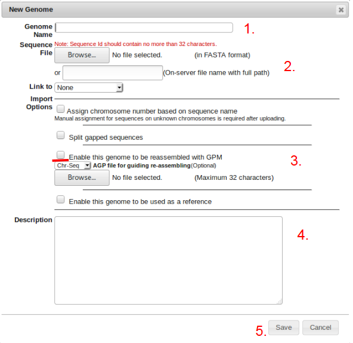

#  [LIMS Docs](README.md)
## [GPM Manual](GPM-Manual.md) > Genome Puzzle Master Basic User Guide
- [GPM Workflow](#gpm-workflow)
- [GPM Main Interface](#gpm-main-interface)
- [Uploading A New Genome](#gpm-main-interface)

### GPM Workflow
- Upload Subject and Reference Genomes.
- Run preliminary alignments of each subject Genome to the Reference.
- Run an assembly of each Genome.
- “Clean Up” each Chromosome for the assemblies.
- Fill any possible gaps using alternative assemblies of the same subject.  
- Eliminate any identifiable contamination.  

### GPM Main Interface

> The “General” tab is used to upload and manage genomes.

> The “Assembly” tab is used to create assemblies of contigs and align them to chromosomes.  

### Uploading A New Genome

>From the GPM main page, click on the "General" tab on the top toolbar.   
1. Click on "Genomes > New Genome"  and fill out the “Genome Name” field.  
2. Browse for the selected fasta file or copy and paste the file path into the box.  
3. Check the box allowing the genome to be reassembled using Genome Puzzle Master. (If the genome is to be assigned as a reference, check the “Enable as reference box.)
4. Specify any descriptive information about the genome being uploaded (ex. File path,estimated size, etc.).
5. Click the save button.
