#  [LIMS Docs](README.md)
## [GPM Manual](GPM-Manual.md) > Genome Puzzle Master Basic User Guide
- [GPM Workflow](#gpm-workflow)
- [GPM Main Interface](#gpm-main-interface)
- [Uploading A New Genome](#uploading-a-new-genome)
- [Running Preliminary Alignments](#running-preliminary-alignments)
- [Creating a Project and Assigning Genomes](#creating-a-project-and-assigning-genomes)
- [Creating an Assembly](#creating-an-assembly)
- [Running an Assembly](#running-an-assembly)
- [Chromosome View](#chromosome-view)
- [“Cleaning Up” and Moving Contigs](#cleaning-up-and-moving-contigs)
- [Contig View](#contig-view)
- [Gap Filling and Merging Contigs](#gap-filling-and-merging-contigs)
- [Breaking Contigs](#breaking-contigs)
- [Flipping Contigs](#flipping-contigs)
- [Alignment Checker](#alignment-checker)
- [Unplaced Contigs](#unplaced-contigs)
- [Troubleshooting](#troubleshooting)

### GPM Workflow
- Upload Subject and Reference Genomes.
- Run preliminary alignments of each subject Genome to the Reference.
- Run an assembly of each Genome.
- “Clean Up” each Chromosome for the assemblies.
- Fill any possible gaps using alternative assemblies of the same subject.  
- Eliminate any identifiable contamination.  

### GPM Main Interface
> The “General” tab is used to upload and manage genomes.
> The “Assembly” tab is used to create assemblies of contigs and align them to chromosomes.  
> 

### Uploading A New Genome
From the GPM main page, click on the "General" tab on the top toolbar.   
1. Click on "Genomes > New Genome"  and fill out the “Genome Name” field.  
2. Browse for the selected fasta file or copy and paste the file path into the box.  
3. Check the box allowing the genome to be reassembled using Genome Puzzle Master. (If the genome is to be assigned as a reference, check the “Enable as reference" box.)
4. Specify any descriptive information about the genome being uploaded (ex. File path,estimated size, etc.).
5. Click the save button.

### Running Preliminary Alignments
1. From the General Tab, on the GPM main screen, click "Run Alignment".
2. Select the uploaded Query genome from the dropdown menu.
3. Select the uploaded Reference of Subject Genome.
4. Specify the Minimum Overlap and Minimum Identity parameters.
5. Click "Run Alignment" to begin the alignment process.  (The alignment process may take several hours and uses a lot of computational resources). 
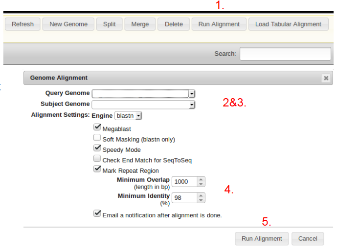

### Creating a Project and Assigning Genomes
1. Click on the "Assembly" tab from the GPM toolbar.
2. Create a new GPM project by clicking on the "New GPM Project" tab.  This is where all of the genomes for the specified project will be assigned for easy organization.
3. Name the GPM project and add a description if necessary.
4. Check the boxes of all of the genomes to be assigned to this project.
5. Click Save when finished.
6. The selected genomes will now be listed under the created project.
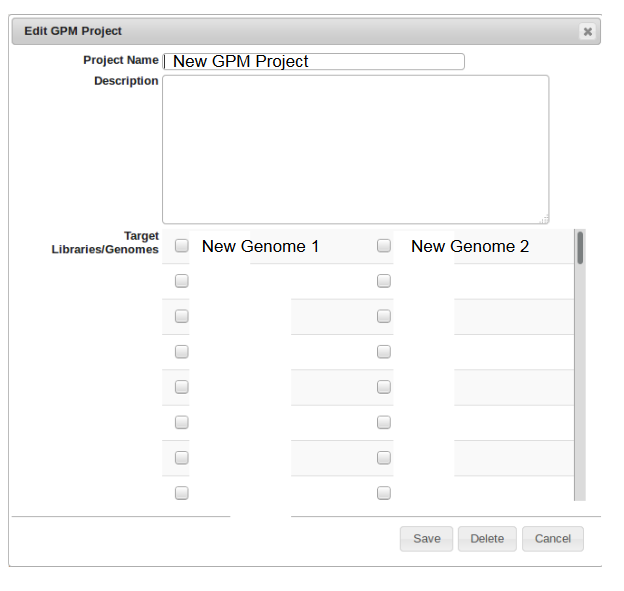

### Creating an Assembly
1. Select the genome to be assembled from the project on the left hand side of the screen.  
2. First, a reference genome must be assigned by clicking the "Assembly Tools" Button.
3. Select the desired uploaded reference genome from the dropdown menu.  
4. Assign “Gap Filler” genomes by checking boxes in the “Extra Genomes” field. 
5. Click “Save” when finished.

### Running an Assembly
1. click on the “Assembly Tools” button and select “Run Assembly”. 
2. Specify the desired assembly parameters (ensure the correct reference genome is being used.)
3. Click “Run Assembly”.

- Before: all contigs are unplaced. 
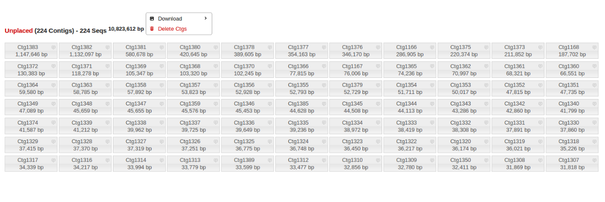

- After: contigs are numbered and assigned to chromosomes.  

### Chromosome View
To view the entire chromosome and all of its assigned contigs, click on the Chromosome number. 

> 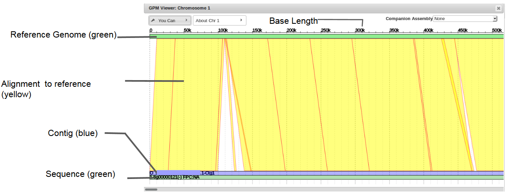

To view two assemblies side-by-side for easy visualization and facilitated gap filling, select a companion assembly from the drop down menu in chromosome view.

> It will appear on top of the target assembly.
> Note that not all of the contigs will be perfectly aligned with their start and end points on the reference genome and will have to be moved.
> 

### “Cleaning Up” and Moving Contigs
Here is an example of what it looks like when a contig needs to be moved.  

It can be seen that the alignment (red and yellow lines) of example contig (top blue line) begins much earlier in the reference genome (middle green line)  than where it is currently placed.  

The general idea is to determine where the alignment begins by following the path of red and yellow lines to where it intersects with the reference genome, and then move the contig to that point.  
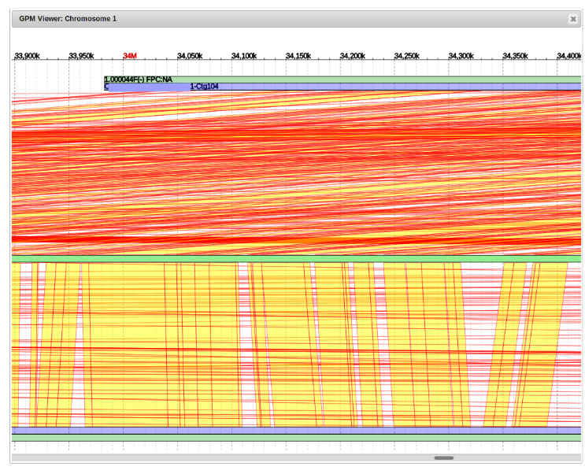

* Moving Contigs
> By scrolling to the left we can determine where that point of origin is. 
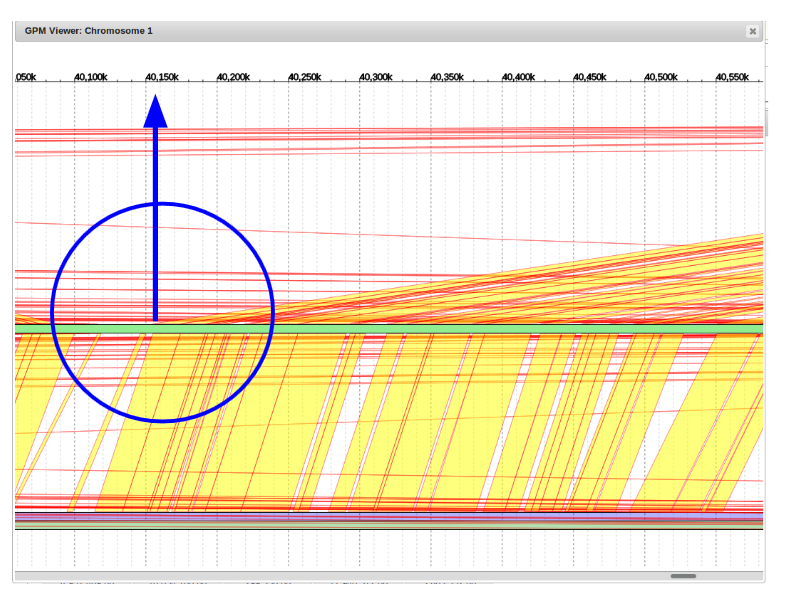

> From here, scroll back to the contig to be moved, right click on the blue portion, and click edit contig.  

> In this example, the alignment point of origin was approximately 40,150,000 bp.  We will change the “Estimated Position” field to this value.  
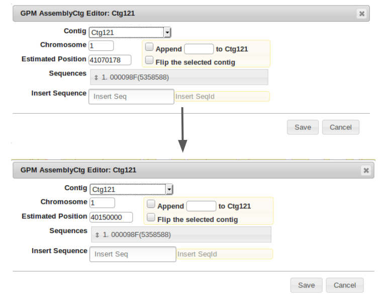

> Shown is the new placement at 40,150,000bp. It clearly aligns well with its counterpart contig from the companion assembly.  
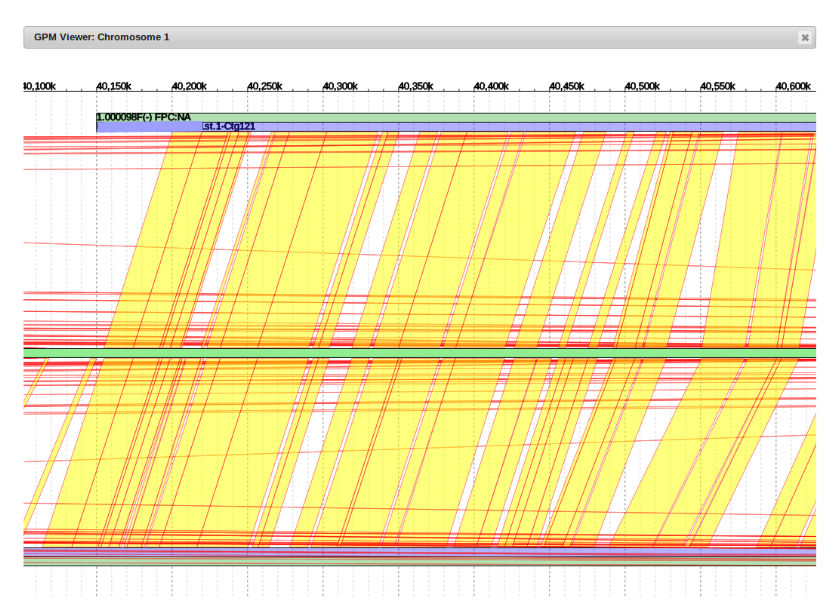

### Contig View
To view a single contig and the sequence(s) that comprise it, simply click on the specified contig number.  

> Shown in green is the sequence that contig 5 in this example is composed of. Note that this contig is made of a single sequence.  Multi-sequence contigs will be covered later under “Gap Filling and Merging Contigs”.

### Gap Filling and Merging Contigs
In this instance a gap on the bottom assembly will be filled using a sequence from the top assembly.  

The blue circle emphasizes a break or gap between two contigs.  

The purple square shows that the sequence in the top assembly bridges the gap on the bottom and shares alignment in the reference genome on both sides of the gap.  

This criteria allows for using the top sequence to fill the bottom gap.  
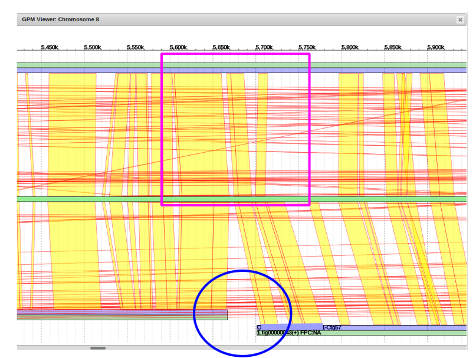

> There are three pieces of information needed to fill this type of gap.  
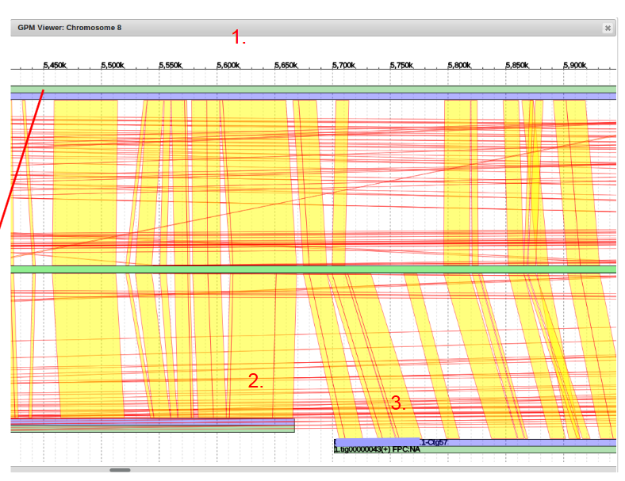
> First the unique identification number of the sequence being used to fill the gap must be known.  This is found by left clicking on the sequence (green portion) of the top contig.  

> Next is determining the contig number of the initial piece of the gap labeled  “2”.   This is easily determined by right clicking the blue portion of the first contig, and selecting “Edit Contig”.  It can be seen that the contig number is “Ctg56”.
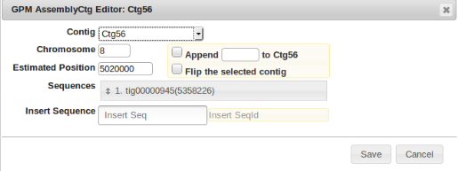

> Last is the number of second contig in the bottom assembly to be filled.   We can see circled in blue that it is “Ctg 57”. With these three pieces of information we can now fill the gap. 

> To Fill the gap, again right click on the initial contig prior to the gap to be filled, in this case Ctg56, and select “Edit Contig”. Now in the “Insert Sequence” field, enter the identification number of the sequence being used to  to bridge the gap. Finally, check the box labeled “Append” and type in the number of the final contig in the sequence after the gap, then click “Save”. The gap has now been filled, however now redundant alignments need to be filtered out of the new contig.  
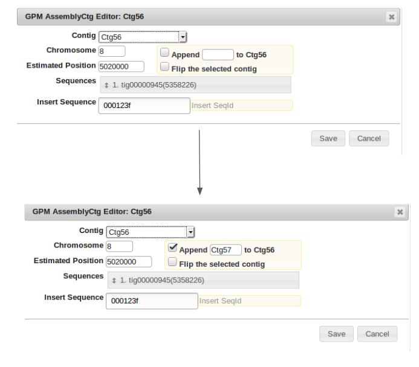

> Closing the chromosome view, we can now see that the new contig 56 contains 3 different sequences.  
> Entering contig view by clicking on contig 56, we can see three sequences present.  
> In order to visualize the alignment between sequences, they must be BLASTed against each other.  
> This is done by right clicking the first sequence labeled “1”, selecting the alignment tab, and selecting BLAST2SEQ.

> Now alignment between each of the sequences can be visualized.  

> Now it is possible for the redundant overlap to be filtered out of the combined contig.  
> This is done by simply right clicking the yellow alignment, and selecting “Smart Redundancy Filter” for each overlapping portion.
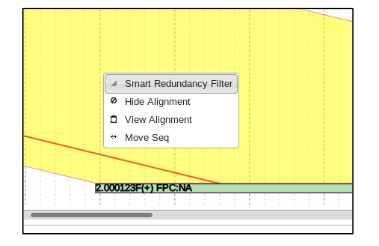

> Here we can see the final result of the gap filling and redundancy filtering process for contig 56.  
> The white or clear sections of the sequences are being hidden, while the green portions are being used in the final contig 56.
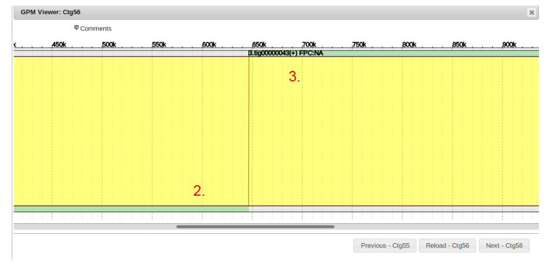

> Before merging

> After merging
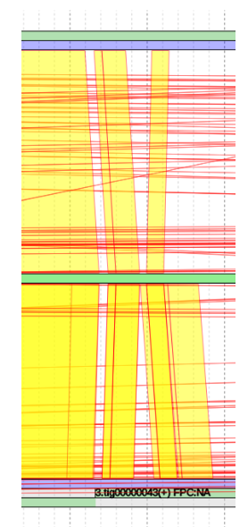

### Breaking Contigs
If ever a misassembly is made when attempting to merge contigs or fill gaps, it is easy to correct using the “Break Contig” function.  

> To use this, enter the contig that is being modified and simply right click on any sequence in the contig to select “Break Contig”.  
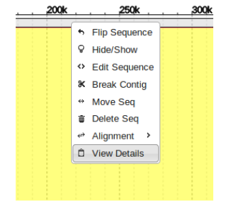

> Drag and drop the “Break From Here” block in between the area that needs to be separated and click “Break”.  
> The separated pieces will receive new contig identification numbers.  
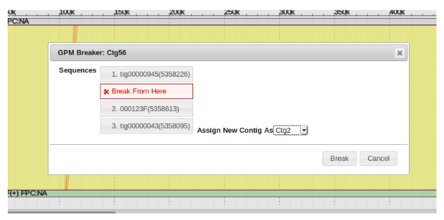

### Flipping Contigs
Sometimes when attempting to fill gaps a sequence will need to be re-oriented prior to redundancy filtering.  
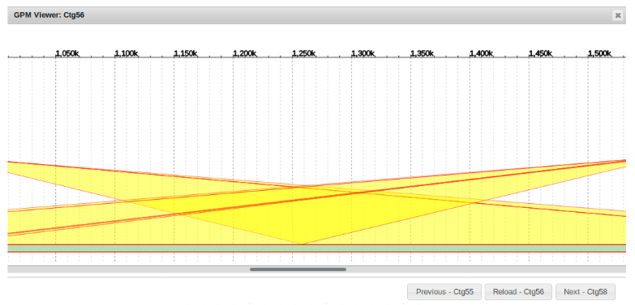

> This is simply done by right clicking the appropriate sequence and clicking “Flip Sequence”. 
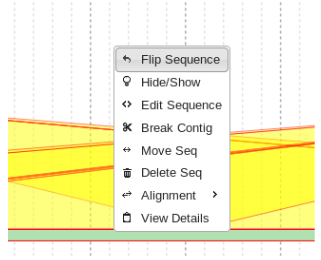

> The result often looks much more manageable and can be more efficiently  filtered for redundancy afterwards. 

### Alignment Checker
Occasionally misassemblies can occur and some contigs will be much longer than they should be, or contigs will be appear to be missing from certain chromosomes.  

With the alignment checker function, it is easy to determine if a long sequence with little identity to the reference genome belongs elsewhere.  

> Right click on the sequence of interest and select “Alignment Checker” from the alignment tab. 

> Similar to the BLAST2SEQ  function, this BLASTS the designated sequence.  However the second “Sequence-2” field is left BLANK.  This causes the desired sequence to be blasted to all of the sequences in the genome.  
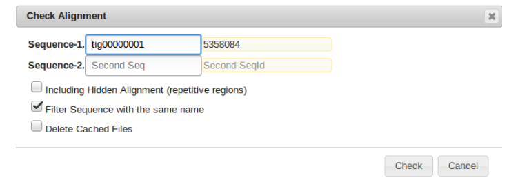

> The output can be easily filtered by a variety of parameters which should provide information as to where the indicated sequence might belong. 
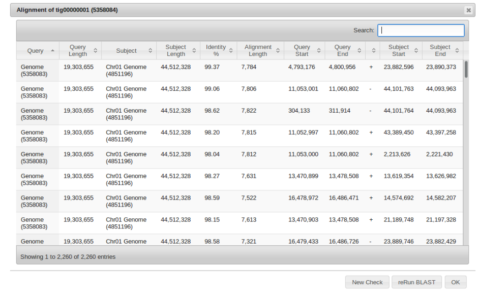

### Unplaced Contigs
Often there are many small (10-400kb) contigs that remain unplaced after finishing an assembly.  These can be easily downloaded and BLASTed either individually or all together to determine if they are due to contamination.  

### Troubleshooting
- If the chromosomes look far too “messy” and there are unmanageable red lines all over, try re-running the alignment between subject and reference with higher identity.
- If not all of the chromosomes have contigs, or seemingly have too few and there are large contigs that are categorized as unplaced, try re-running the alignment with lower identity or lower minimum base overlap. 